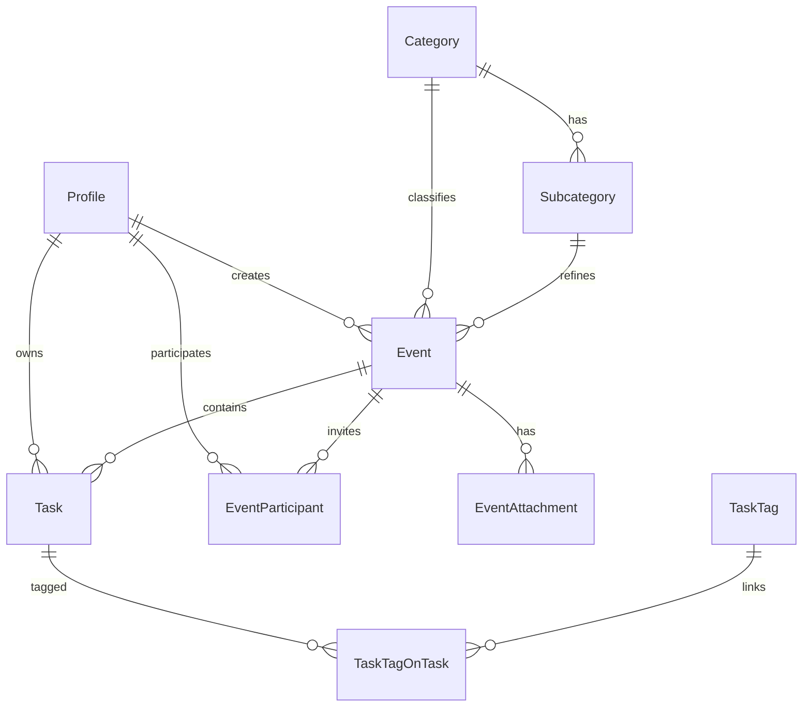
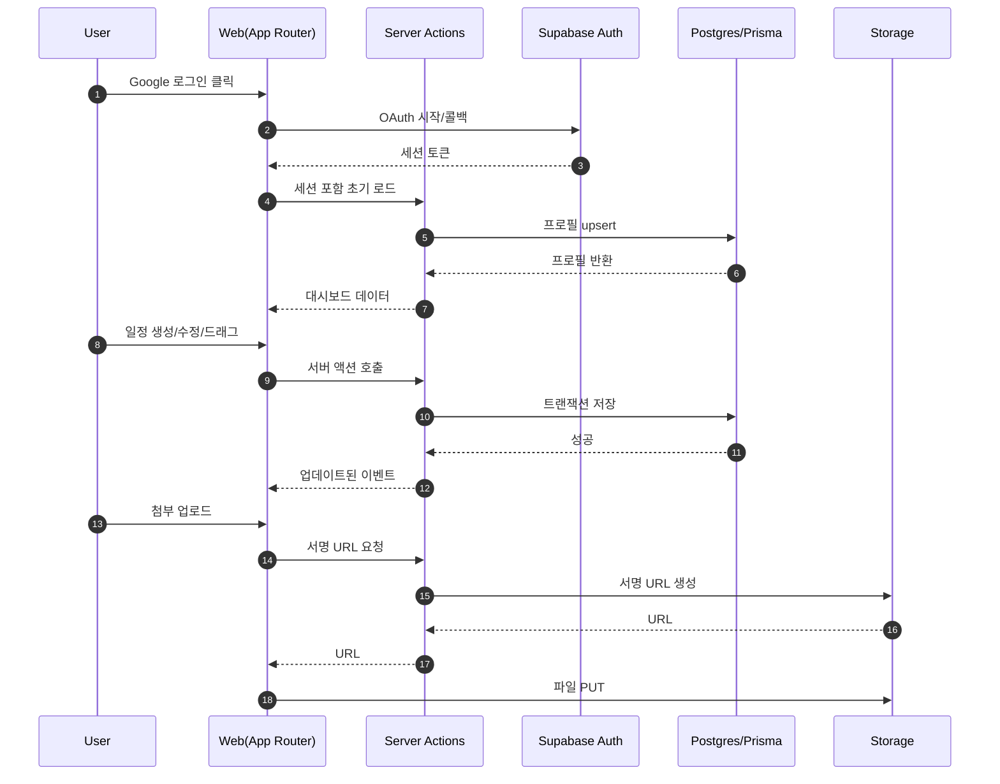

## 시스템 설계 문서 · Smart Calendar

### 1) 기술 스택 및 주요 라이브러리 🧰

- **Framework**: Next.js (App Router), React 19, TypeScript
- **UI**: ShadCN UI, Tailwind CSS, Radix UI, `lucide-react`
- **Calendar**: `@fullcalendar/react` + `@fullcalendar/daygrid` + `@fullcalendar/timegrid` + `@fullcalendar/interaction`
- **Drag & Drop**(칸반): `@hello-pangea/dnd`
- **Form/Validation**: `react-hook-form`, `zod`, `@hookform/resolvers`
- **Date/Time**: `date-fns`, `date-fns-tz`
- **State/Data**: 서버 액션 중심 + SWR(선택) 또는 React Query(선택) — MVP는 서버 액션 기반
- **Auth/DB/Storage**: Supabase (Auth·Postgres·Storage)
- **ORM**: Prisma (Supabase Postgres 연결)
- **Test**: Vitest(유닛/도메인), Playwright MCP(E2E), Testing Library(UI)

### 2) 아키텍처 개요 🏗️

```mermaid
  graph TD
    A[Browser · UI] --> B[Next.js App Router]
    B --> C[Server Actions / Route Handlers]
    C --> D[Prisma · Postgres (Supabase)]
    C --> E[supabase-js (Auth/Storage)]
    E --> F[Supabase Auth]
    D --> G[Postgres · public schema]
    E --> H[Supabase Storage]
```

- 원칙: 쓰기(Write)와 관리자 기능은 서버 전용 경로에서 Prisma로 수행(안전·일관성). 클라이언트 측은 읽기 위주로 최소화.
- 인증: Supabase Auth(Google) → 세션 토큰 기반 서버 액션 보호.

### 3) 디렉터리 구조(초안) 🗂️

```
app/
  (marketing)/page.tsx
  (dashboard)/layout.tsx
  (dashboard)/calendar/page.tsx
  (dashboard)/tasks/page.tsx
  admin/
    categories/page.tsx
  api/
    upload/route.ts  # 서명 URL 발급 등
components/
  calendar/Calendar.tsx
  calendar/EventCard.tsx
  calendar/EventForm.tsx
  kanban/TaskBoard.tsx
  shared/*
lib/
  prisma.ts
  supabase.ts
  auth.ts
  validators/*
  utils/date.ts
styles/
  globals.css
```

### 4) 데이터 모델(Prisma) 🗃️

```prisma
  // prisma/schema.prisma
  generator client {
    provider = "prisma-client-js"
  }
  datasource db {
    provider = "postgresql"
    url      = env("DATABASE_URL") // Supabase Postgres 연결 문자열
  }

  model Profile {
    id           String   @id @default(uuid()) @db.Uuid    // == auth.users.id (동일 UUID 사용)
    email        String   @unique
    displayName  String?
    avatarUrl    String?
    isAdmin      Boolean  @default(false)
    timezone     String   @default("Asia/Seoul")
    createdAt    DateTime @default(now())
    updatedAt    DateTime @updatedAt

    events       Event[]
    tasks        Task[]    @relation("TaskOwner")
  }

  model Category {
    id          String   @id @default(uuid()) @db.Uuid
    name        String
    colorHex    String   @default("#7C3AED")
    isActive    Boolean  @default(true)
    sortOrder   Int      @default(0)
    createdById String   @db.Uuid
    createdAt   DateTime @default(now())
    updatedAt   DateTime @updatedAt

    createdBy   Profile  @relation(fields: [createdById], references: [id])
    subcats     Subcategory[]

    @@unique([name])
  }

  model Subcategory {
    id          String   @id @default(uuid()) @db.Uuid
    categoryId  String   @db.Uuid
    name        String
    colorHex    String?  // 미지정 시 Category 색상 상속
    sortOrder   Int      @default(0)
    isActive    Boolean  @default(true)

    category    Category @relation(fields: [categoryId], references: [id])

    @@unique([categoryId, name])
  }

  model Event {
    id            String    @id @default(uuid()) @db.Uuid
    title         String
    description   String?
    categoryId    String    @db.Uuid
    subcategoryId String?   @db.Uuid
    startsAt      DateTime
    endsAt        DateTime
    allDay        Boolean   @default(false)
    location      String?
    rrule         String?   // 포스트 MVP
    createdById   String    @db.Uuid
    createdAt     DateTime  @default(now())
    updatedAt     DateTime  @updatedAt

    category      Category  @relation(fields: [categoryId], references: [id])
    subcategory   Subcategory? @relation(fields: [subcategoryId], references: [id])
    createdBy     Profile   @relation(fields: [createdById], references: [id])

    attachments   EventAttachment[]
    participants  EventParticipant[]
    tasks         Task[]

    @@index([startsAt])
    @@index([createdById])
  }

  model EventAttachment {
    id           String   @id @default(uuid()) @db.Uuid
    eventId      String   @db.Uuid
    bucket       String   @default("attachments")
    path         String   // storage object path
    fileName     String
    mimeType     String
    sizeBytes    Int
    uploadedById String   @db.Uuid
    createdAt    DateTime @default(now())

    event        Event    @relation(fields: [eventId], references: [id])
    uploadedBy   Profile  @relation(fields: [uploadedById], references: [id])

    @@index([eventId])
  }

  model EventParticipant {
    id         String   @id @default(uuid()) @db.Uuid
    eventId    String   @db.Uuid
    profileId  String   @db.Uuid
    role       ParticipantRole @default(VIEWER)

    event      Event    @relation(fields: [eventId], references: [id])
    profile    Profile  @relation(fields: [profileId], references: [id])

    @@unique([eventId, profileId])
  }

  enum ParticipantRole {
    OWNER
    EDITOR
    VIEWER
  }

  model Task {
    id           String   @id @default(uuid()) @db.Uuid
    eventId      String?  @db.Uuid             // 업무 카테고리 일정과 연결(옵션)
    title        String
    description  String?
    status       TaskStatus @default(TODO)
    position     Int       @default(0)
    priority     TaskPriority @default(NORMAL)
    dueDate      DateTime?
    assignedToId String?   @db.Uuid
    createdById  String    @db.Uuid
    createdAt    DateTime  @default(now())
    updatedAt    DateTime  @updatedAt

    event        Event?    @relation(fields: [eventId], references: [id])
    assignedTo   Profile?  @relation(fields: [assignedToId], references: [id])
    owner        Profile   @relation("TaskOwner", fields: [createdById], references: [id])
    tags         TaskTagOnTask[]

    @@index([eventId])
    @@index([status, position])
  }

  enum TaskStatus {
    TODO
    IN_PROGRESS
    BLOCKED
    DONE
  }

  enum TaskPriority {
    LOW
    NORMAL
    HIGH
    URGENT
  }

  model TaskTag {
    id        String   @id @default(uuid()) @db.Uuid
    name      String
    colorHex  String   @default("#64748B")

    tasks     TaskTagOnTask[]

    @@unique([name])
  }

  model TaskTagOnTask {
    taskId  String @db.Uuid
    tagId   String @db.Uuid

    task    Task   @relation(fields: [taskId], references: [id])
    tag     TaskTag @relation(fields: [tagId], references: [id])

    @@id([taskId, tagId])
  }
```

### 5) ERD (개념도)



### 6) 서비스 흐름도



### 7) 권한/RLS(제안) 🔐

- 원칙: 사용자 본인 `createdById = auth.uid()` 데이터만 접근. 관리자는 카테고리 전역 관리 가능.
- 예시 정책(문서 제안용, 실제 적용은 관리자 승인·코드리뷰 필수)
  - Events SELECT/INSERT/UPDATE/DELETE: `created_by = auth.uid()` 또는 `profiles.is_admin = true`
  - Attachments: 소유자만 접근, 공유는 서명 URL로 제한 시간 제공.

### 8) 캘린더/칸반 UI 동작 규칙 🗓️

- 겹치는 일정 배치: FullCalendar timeGrid에서 동일 시간대는 컬럼 분할로 모두 표시.
- 추가/수정: 셀 클릭 팝오버 → 빠른 생성, 자세히 보기에서 전체 편집.
- 드래그/리사이즈: interaction 플러그인 사용, 변경 시 서버 액션에 최소 페이로드 PATCH.
- 칸반: `@hello-pangea/dnd`로 열/카드 이동, 낙관적 UI → 실패 시 롤백.

### 9) 컬러 팔레트 🎨

- Primary: `#7C3AED` (Violet-600)
- Secondary: `#22C55E` (Green-500)
- Accent: `#F59E0B` (Amber-500)
- Info: `#0EA5E9` (Sky-500)
- Danger: `#EF4444` (Red-500)
- Neutral: `#0F172A` (Slate-900), `#64748B` (Slate-500), `#F1F5F9` (Slate-100)
- 카테고리 색상은 팔레트 내에서 변형(채도/명도)으로 생성.

### 10) 컴포넌트 와이어프레임 🧩

- 레이아웃: Top Nav(검색/아바타) · Left Sidebar(카테고리 필터) · Main(Calendar/Tasks)
- 캘린더: Toolbar(월/주/일, 오늘, 검색) · Grid(이벤트 카드) · Popover(Event Form)
- 업무 보드: Columns(Todo/In-Progress/Blocked/Done) · Card(Task)
- 관리자: Category List · Form(색 선택, 정렬, 활성화)

```text
  [TopBar]
  [Sidebar] | [Calendar View / Task Board]
  Event Popover(Form): 제목, 카테고리, 시간, 설명, 첨부
```

### 11) SEO 설계 🔎

- 라우팅 구조(초안)
  - `/` (마케팅/소개)
  - `/calendar` (대시보드 기본)
  - `/tasks` (업무 보드)
  - `/admin/categories` (관리)
  - `/profile`
- App Router `metadata`로 title/description/OG, `/sitemap.xml`, `/robots.txt`, 기본 JSON-LD(Organization, WebSite) 적용.

### 12) 테스트 전략 🧪

- 단위: 날짜 유틸, 밸리데이터(zod), 서버 액션 비즈니스 로직(Vitest)
- 컴포넌트: 폼·모달 상호작용(Test. Library)
- E2E: Playwright MCP 시나리오
  - 로그인 → 대시보드 진입
  - 일정 생성/수정/드래그 → 보존 확인
  - 업무 보드: 카드 생성·이동·삭제
  - 첨부 업로드/다운로드

```ts
// 예시: Playwright E2E 스케치
import { test, expect } from "@playwright/test";

test("캘린더에서 일정 생성 후 보드 연결", async ({ page }) => {
  await page.goto("/");
  await page.getByRole("button", { name: "Google로 시작" }).click();
  // ... OAuth 스텁 or 테스트용 계정 로그인
  await page.goto("/calendar");
  await page.getByText("09:00").click();
  await page.getByLabel("제목").fill("스프린트 플래닝");
  await page.getByRole("button", { name: "저장" }).click();
  await expect(page.getByText("스프린트 플래닝")).toBeVisible();
});
```

### 13) 에러 처리/로깅 🧯

- 표준 에러 응답 포맷(문서화)과 사용자용 토스트/다이얼로그.
- 서버 액션 try/catch + 구조화 로깅(요청 ID).

### 14) 성능 최적화 ⚡

- 캘린더 페이징(월 단위) 데이터 로딩, category 필터 캐싱, 이미지 리사이즈 업로드.
- 코드 스플리팅: 캘린더/칸반 지연 로딩.

### 15) 배포 및 환경 변수 🌐

- Vercel 배포, 환경변수: `DATABASE_URL`, `SUPABASE_URL`, `SUPABASE_ANON_KEY`, `SUPABASE_SERVICE_ROLE_KEY`(서버 전용), `NEXT_PUBLIC_SITE_URL` 등.
